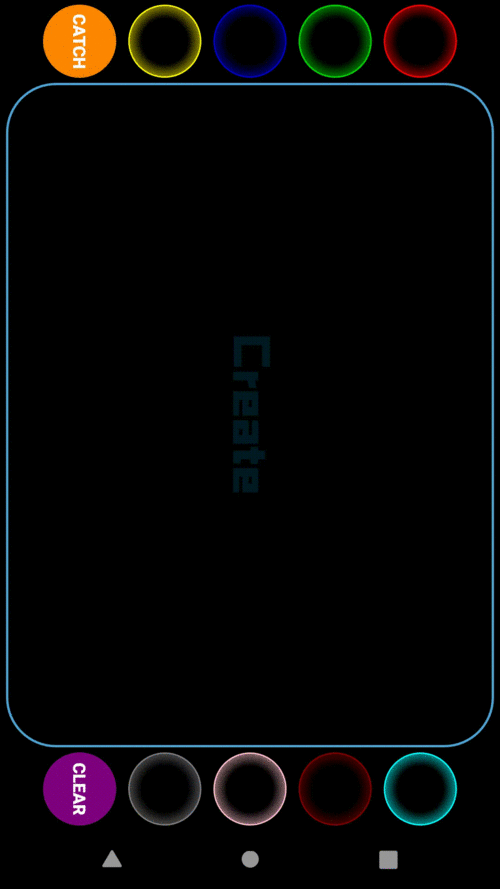

# PhysicsLayout

## Development Environment

- Android Studio 3.1.1
- Android api 28


## Gradle Dependency

Add this in your build.gradle
```
allprojects {
	repositories {
		...
		maven { url httpsjitpack.io }
	}
}
```
then add library to your project
```
dependencies {
    implementation 'com.github.JawnnypooPhysicsLayout2.1.0'
}
```

## How to use

Just change your root layout

```
com.jawnnypoo.physicslayout.PhysicsLinearLayout
    androidid=@+idphysics_layout
    androidlayout_width=match_parent
    androidlayout_height=match_parent
            
      ImageView
        androidlayout_width=wrap_content
        androidlayout_height=wrap_content
        androidsrc=@drawableic_launcher

      ImageView
        androidlayout_width=wrap_content
        androidlayout_height=wrap_content
        androidsrc=@drawableic_launcher

     
  com.jawnnypoo.physicslayout.PhysicsLinearLayout
 ```
and there are many attributes to change
```
    appphysics=true
    appgravityX=0.0
    appgravityY=9.8
    appbounds=true
    appboundsSize=50dp
    
 ```
 ## example
 
 
