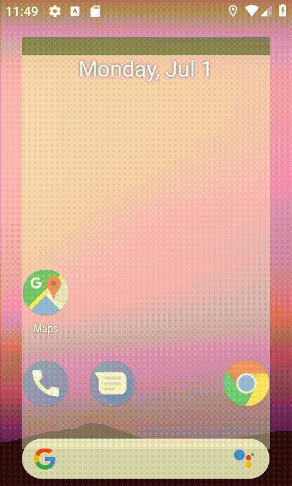

# PhysicsLayout

## Development Environment

- Android Studio 3.1.1
- Android api 28


## Gradle Dependency

Add this in your build.gradle
```
allprojects {
	repositories {
		...
		maven { url httpsjitpack.io }
	}
}
```
then add library to your project
```
dependencies {
    implementation 'com.github.Jawnnypoo:PhysicsLayout:2.1.0'
}
```

## How to use

You can customize your layout what you want

```
    <com.jawnnypoo.physicslayout.PhysicsLinearLayout

        android:layout_width="300dp"
        android:layout_height="300dp"
        android:background="#666666"
        android:gravity="center"
        app:layout_constraintBottom_toBottomOf="parent"
        app:layout_constraintEnd_toEndOf="parent"
        app:layout_constraintStart_toStartOf="parent"
        app:layout_constraintTop_toTopOf="parent">

        <Button

            android:text="test"
            android:layout_width="50dp"
            android:layout_height="50dp"
            android:background="@drawable/test" />

    </com.jawnnypoo.physicslayout.PhysicsLinearLayout>
    
 ```
and there are many XML attributes can change

```
 <com.jawnnypoo.physicslayout.PhysicsLinearLayout
    android:id="@+id/physics_layout"
    android:layout_width="300dp"
    android:layout_height="300dp"
    app:physics="true"
    app:gravityX="0.0"
    app:gravityY="9.8"
    app:bounds="true"
    app:boundsSize="50dp"/>
 ```
 - ```physics``` 布林值,是否使用物理效果於佈局裡？(預設為true)
 - ```gravityX``` 浮點數,x軸方向的重力(預設為0)
 - ```gravityY``` 浮點數,y軸方向的重力(預設為9.8)
 - ```bounds``` 布林值,判斷是否有邊界(預設為true)
 - ```boundsSize``` 設置邊界寬度
 
 
 
 ## Method
 
 ```
     public void random(View view) {
        range.getPhysics().giveRandomImpulse();
    }
```
